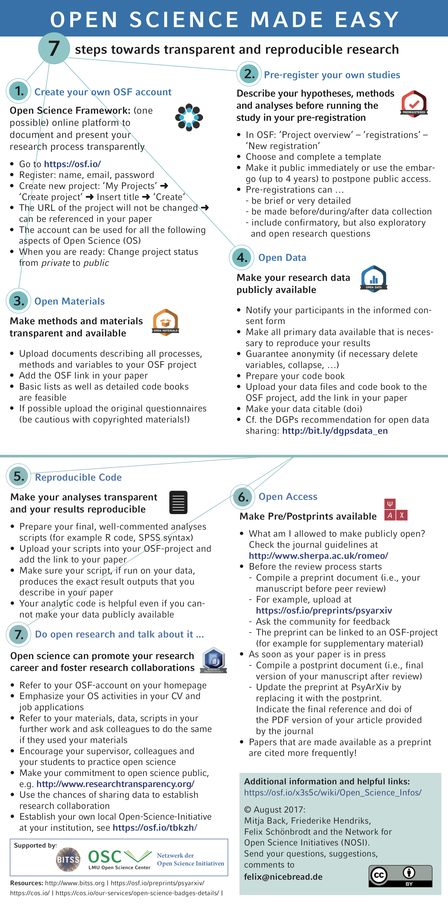

<div class="mycontent">


## Existing educational materials
***

<br>

<div class="column-left">
{width=160px} <br><br>
</div>

Make your existing teaching and mentoring materials open. These can in  about prototypical subject-matters like in areas within Psychology, Political Science, Statistics, Economics, Neuroscience, Philosophy, History, etc. These can be in any language. You can then iteratively improve you materials. Non-exhaustive examples are: enhacing its documentation, adding media (transcripts, voice, video), making it multilanguage, and accessible to people with disability. The goal is to make your materials as understandable as possible to others, so they can be useful for both learning and teaching purposes. Other educators can then reuse and/or adapt it to their own context and needs - reducing time encumberment for producing high-quality materials and its access - effectively allowing meaningful participation of civil society in learning, research and innovation.


## Past and current research materials
***

<br>

<div class="column-left">
{width=130px} <br><br>
[_expand image_](https://how-to-open.science/change/educate/OSC_Flyer_15x15_Englisch.png){target="_blank"}

</div>

Make your research open. An often neglected aspect is that your research serves the community as an educational material. Increasingly, well documented research repositories are used in undergraduate and graduate education. Think of the Collaborative Replications and Education Project in Psychology ([CREP](https://osf.io/wfc6u/){target="_blank"}), the Political Science Replication Initiative ([PSRI](https://politicalsciencereplication.wordpress.com/){target="_blank"}), its Economics' [counterpart](http://replication.uni-goettingen.de/wiki/index.php/Portal:Replication_in_teaching){target="_blank"}. How to achieve this? Thankfully, it is very easy. Create an [OSF account](https://osf.io/), include your studies' materials (code, codebooks, data, etc) in a repository, and you are done! 

If you want to learn more about "How to Open Science", visit [FORRT's Educational Nexus](https://forrtv2.netlify.com/as.resource.tool.html).


<br><br>

```{redcars}
[to add]
There are many ways to implement FORRT's Pricipled Education. 

* One regards the "method of teaching". One can foster an Open envirnoment so students can exercise "Open Learning" in which access to information and good-quality educational materials are not where the "grading" and "evaluation" happens but rather at the processing level, at the creativity, and ability to diferenciate themselves.

```


<br>


</div>


<br><br>