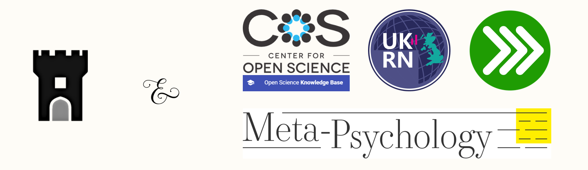

<div class="mycontent">

<br>

## What is FORRT?
***

Current norms for the teaching and mentoring of higher-education are rooted in obsolete practices of bygone eras. Improving transparency and rigor of science is the responsibility of all who engage in it, but ongoing attempts have neglected an essential aspect of the academic machinery: students. FORRT, a Framework for Open and Reproducible Research Training, is introduced to raise awareness of the pedagogical implications of Open Science and its associated challenges (curricular reform, epistemological uncertainty, methods education, openness and social justice). Aimed at the training of researchers and consumers of science, FORRT is an effective, evolving, and community-driven framework toward the incremental adoption of principled teaching and mentoring practices, and supporting instructors by collating existing teaching pedagogies and materials to be reused and adapted for use within new and existing courses. 

<br>

With FORRT, educators in higher-education have an unprecedented opportunity to shape the minds and future of the consumers of science and the next generation of academics. At its best, FORRT should be the answer to the question **_“what are the best conceivable educational practices in higher education and how to achieve it?”_**

<br>

## How Can You Help?
***

<br>

<div class="column-left">
{width=90px} <br><br>
**Spread the Word** 
<br>
Better Education is for everyone. Help us spread the word by joining our open [Slack channel](https://forrt.slack.com/) and invite your friends and colleagues to be part of our community.
</div>


<div class="column-center">
{width=90px} <br><br>
**Join Our Team** 
<br>
Everything we develop and produce is in the open. You can join our team [on GitHub](https://github.com/flavioazevedo/FORRT). If you want to become an active contributors [email us](mailto:FORRTproject@gmail.com).
</div>


<div class="column-right">
{width=90px} <br><br>
**Become a Partner** 
<br>
We have three different partner levels (Core, Strategic and Institutional) that help us to develop the principles enshrined in FORRT. If you want to become a partner [email us](mailto:FORRTproject@gmail.com).
</div>

<br>

<div align="right">
[Get involved! <i class="right"></i>](https://forrtv2.netlify.com/getinvolved)
</div>

  
<br>

## The Products of FORRT
***


<div class="column-left"><br>
[ {width=120px} ](https://osf.io/bnh7p/)
<br><br>
</div>

**Manuscript**. FORRT's team wrote a manuscript aiming at explaing _`why`_ open and reproducible tenets should be incorporated in the teaching and mentoring of prototypical subject matters. We hope it lays the ground work for .... Ut maluisset urbanitas suscipiantur sed. Vel facete possim definitiones in, vis ex sumo autem dolor. Has nostrum ocurreret eloquentiam te, his ad maluisset splendide percipitur. 

<br>

<div class="column-right"><br>
[ {width=120px} ](https://osf.io/bnh7p/)
<br><br>
</div>

**Educational Nexus**. Lorem ipsum dolor sit amet, an conceptam definitiones vix, velit blandit mandamus no has. Dolorum interesset sadipscing duo id, cum et oratio corpora nostrum, quo primis alterum probatus no. Ius in luptatum erroribus, quem adversarium ne his. Et viris voluptaria nec, id nam adhuc sensibus, euismod abhorreant eloquentiam at eam. Ea vix accusam comprehensam, usu ea omnium intellegat honestatis, ad vix alia tollit urbanitas. 

<br>

<div class="column-left"><br>
[ {width=120px} ](https://forrtv2.netlify.com/pedagogies_main.html)
<br><br>
</div>

**Pedagogies**. Lorem ipsum dolor sit amet, an conceptam definitiones vix, velit blandit mandamus no has. Dolorum interesset sadipscing duo id, cum et oratio corpora nostrum, quo primis alterum probatus no. Ius in luptatum erroribus, quem adversarium ne his. Et viris voluptaria nec, id nam adhuc sensibus, euismod abhorreant eloquentiam at eam. Ea vix accusam comprehensam, usu ea omnium intellegat honestatis, ad vix alia tollit urbanitas. 


## Partnerships
***

<br>

<center>
{width=800px} <br><br>
</center>

<br>

|      __*Meta-psychology special issue*__. We have an opportunity in conjunction with [Meta-Psychology](https://open.lnu.se/index.php/metapsychology) and the [Psychological Science Accelerator](https://psysciacc.org/) to work on a recurring special issue. The call will request teaching materials, including the pedagogical aspect desired by FORRT. This will be an ongoing source of resources to curate with FORRT and for FORRT to disseminate. This also sets the stage for our vision of academia in which teaching resources are more valued - changing the publications structure to include these excellent and open resources is a part of this. 


|      __*Center for Open Science Knowledge Base*__. We are partnering up with OSKB. Lorem ipsum dolor sit amet, an conceptam definitiones vix, velit blandit mandamus no has. Dolorum interesset sadipscing duo id, cum et oratio corpora nostrum, quo primis alterum probatus no. Ius in luptatum erroribus, quem adversarium ne his. Et viris voluptaria nec, id nam adhuc sensibus, euismod abhorreant eloquentiam at eam. Ea vix accusam comprehensam, usu ea omnium intellegat honestatis, ad vix alia tollit urbanitas.  

<br>

## Stay Updated
***

Subscribe to our newsletter, get the latest news from FORRT and about our initiatives.

<p>
  <a class="btn btn-primary" data-toggle="collapse" href="#collapseExample1" role="button" aria-expanded="false" aria-controls="collapseExample1">
    Subscribe to our Newsletter
  </a>
</p>
<div class="collapse" id="collapseExample1">
  <div class="card card-body">

  ```{r}
  "Feature available soon"
  ```

  </div>
</div>


<br>

</div>


<br><br>