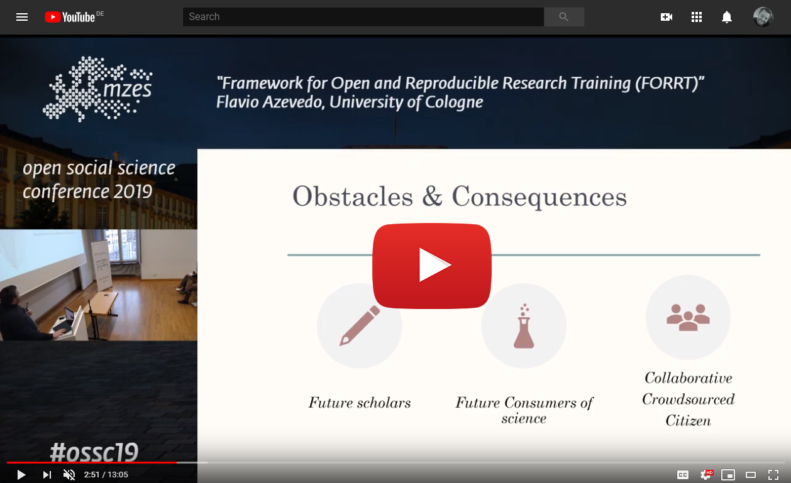
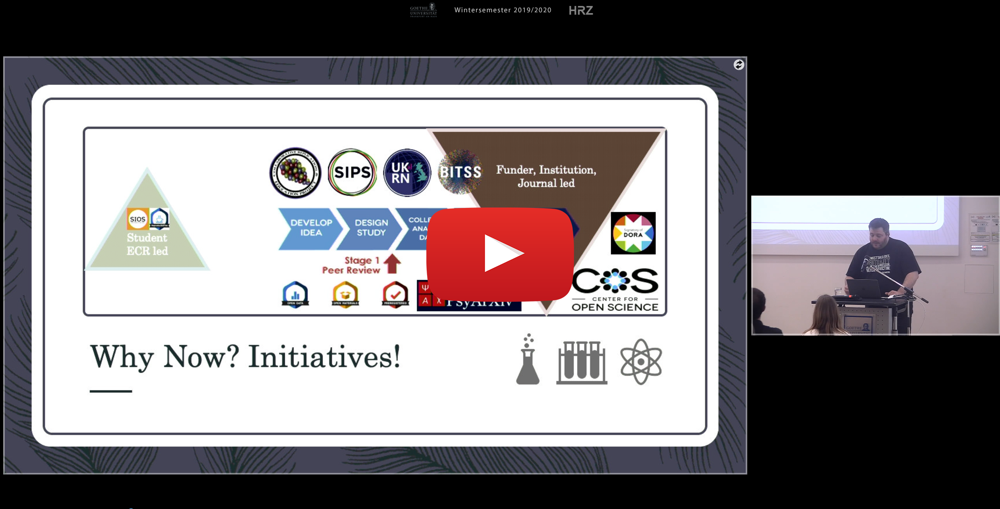

<div class="mycontent">


## FORRT's Presentations
***

### Open Science Day at Goethe University

The <a href="https://open-science-frankfurt.github.io/tag/news.html" target="_blank">Frankfurt Open Science Initiative</a> organized an _Open Science Day_ in Frankfurt at Goethe University whose theme revolved around Open Science and Teaching. FORRT was featured as one of the two main talks, and below you find the recording of FORRT's presentation. For an _aperçu_ of the whole event, see [this Twiter thead.](https://twitter.com/OpenScienceFFM/status/1222523707870056450){target="_blank"}


<br>

<center>
[{width=450px}](http://www.youtube.com/watch?v=gM2s8GZULfI&t "FORRT at Open Science Day at Goethe University"){target="_blank"}
</center>

<br>

### MZES Open Social Science Conference

At its very early stage, FORRT was featured at <a href="https://www.mzes.uni-mannheim.de/openscience/index.php/schedule/" target="_blank">MZES Open Social Science Conference</a> which aimed at practicing new standards in transparency and reproducibility. Taking place from 25-27 January 2019, Mannheim, Germany, this conference discussed research on the credibility, transparency, and replicability of social science research and provided a forum for discussing the state of and future directions for open science in the social sciences.


<br>
<center>
[{width=500px}](https://video01.uni-frankfurt.de/Mediasite/Play/8fae430a4ee24d62a7f61985f74f27121d "FORRT at MZES Open Social Science Conference 2019"){target="_blank"}
</center>

<br>

## FORRT's Events
***

<br>

```{redcars}
[List all presentations: ReproTea, SIPS, OSSC, ProjectTier]
```


</div>


