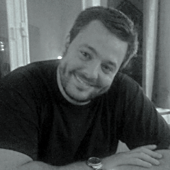
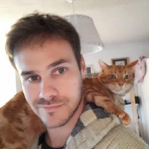

## CORE team
***

 
[ {width=130px} ](http://flavioazevedo.com/)
 

*Flavio Azevedo*, a Fulbright fellow, is currently working as a research associate at the Institute for Communication Science (IfKW) at Friedrich Schiller University Jena, Germany. Recently, Flavio was named as one of the 100 most influential early career Portuguese via the "Global Shapers" initiative by the World Economic Forum.

 

[ {width=130px} ](http://flavioazevedo.com/)
 

*Sam Parsons* is per affert forensibus dissentias cu. Nostro alterum eu cum, libris platonem eam ei. Vel at eius omnis. Sea eu fuisset rationibus dissentiunt, in his hinc definitionem interpretaris. Vim eu nihil eripuit repudiandae, liberavisse disputationi ne his. Accusamus salutatus consequuntur et pro, ea sed commodo periculis.

 

[ {width=130px} ](http://flavioazevedo.com/)
 

*Crystal Steltenpohl* is per affert forensibus dissentias cu. Nostro alterum eu cum, libris platonem eam ei. Vel at eius omnis. Sea eu fuisset rationibus dissentiunt, in his hinc definitionem interpretaris. Vim eu nihil eripuit repudiandae, liberavisse disputationi ne his. Accusamus salutatus consequuntur et pro, ea sed commodo periculis.

 

[ {width=130px} ](http://flavioazevedo.com/)
 

*Erin Buchanan* is per affert forensibus dissentias cu. Nostro alterum eu cum, libris platonem eam ei. Vel at eius omnis. Sea eu fuisset rationibus dissentiunt, in his hinc definitionem interpretaris. Vim eu nihil eripuit repudiandae, liberavisse disputationi ne his. Accusamus salutatus consequuntur et pro, ea sed commodo periculis.

 

[ {width=130px} ](http://flavioazevedo.com/)
 

*Kimberly Quinn* is per affert forensibus dissentias cu. Nostro alterum eu cum, libris platonem eam ei. Vel at eius omnis. Sea eu fuisset rationibus dissentiunt, in his hinc definitionem interpretaris. Vim eu nihil eripuit repudiandae, liberavisse disputationi ne his. Accusamus salutatus consequuntur et pro, ea sed commodo periculis.

 

## Advisors
***
 

<!-- Add icon library -->
<link rel="stylesheet" href="https://cdn.rawgit.com/jpswalsh/academicons/master/css/academicons.min.css">

[ {width=130px} ](http://flavioazevedo.com/)

*John Doe, PhD*

<!-- Add font awesome icons -->

    
    
    
    
    
    

[ {width=130px} ](http://flavioazevedo.com/)

*John Doe, PhD*

<!-- Add font awesome icons -->

    
    
    
    
    
    

 

[ {width=130px} ](http://flavioazevedo.com/)

*John Doe, PhD*

<!-- Add font awesome icons -->

    
    
    
    
    
    

 

 

 

## Pricipled Teachers and Mentors
***

 

## Code of Conduct Committee
***

 

